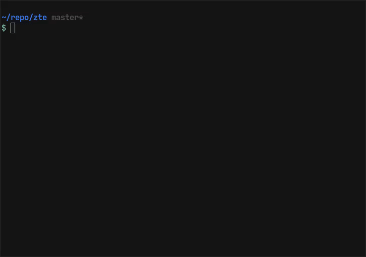

# zte

A terminal text editor written in Zig.
I'll try to keep this project building with the latest version of
zig, but I do not really indend to work much more on this.

Things I remember about this editor:
* I was playing around with immutable data structures, so the entire editor
  is based around this concept (See the immutable list implementation
  [here](src/core/list.zig)).
  * This editor currently just leaks all its memory. The idea was to
    implement some manual garbage collector where the implementer would
    have to tag memory as alive themself and then they could run it
    to clean up the rest.
* There is also a terminal [UI *framework*](src/draw.zig)
  in there that allows programmers
  to statically declare the layout of the UI at compile time.
  * In theory, the layout is completly seperated from the drawing
    of the layout, allowing for many backends. In practice, it might
    not be this simple though.
  * There is also a terminal backend for this *framework*
* It nearly has no dependencies, only relying on glibc for
  [1 function](src/c.zig).

